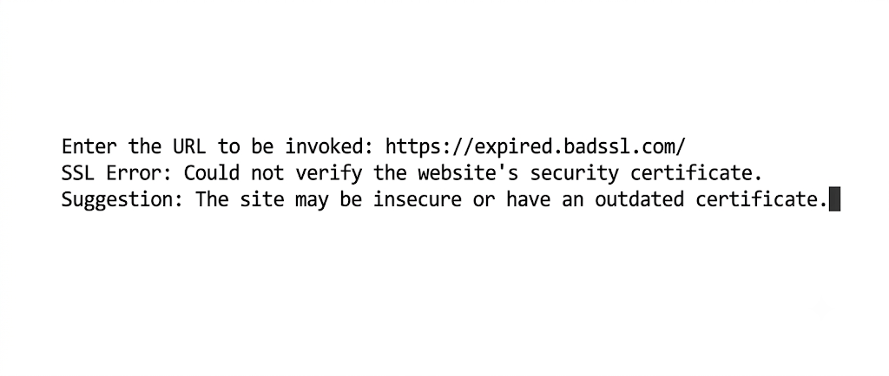

# Fetch HTTP Response Code

This project provides a Python command-line utility that takes a URL as input, makes an HTTP GET request, and returns the response status. 



## Features

* **Interactive Prompt:** Asks the user to input a URL via the command line.
* **Status Reporting:** Successfully fetches and displays the HTTP status code, standard status message, and the server's response reason.
* **Robust Error Handling:** Catches and provides human-readable suggestions for common `requests` exceptions, including:
  * Unresolved domain names (typos in the URL).
  * Refused connections (downed services or firewall blocks).
  * Timeouts.
  * Invalid URL formats (missing `http://` or `https://` schemas).
  * SSL certificate verification failures.
  * Proxy configuration errors.
  * Infinite redirect loops.

## Project Structure

```text
Fetch_HTTP_Response_Code/
├── response.py
```
## Installation
Follow these steps to set up the project on your local machine. Ensure you have Python installed before proceeding.

1. Clone the repository to your local machine:

```Bash
git clone https://github.com/saharshbhatnagar/Fetch_HTTP_Response_Code.git
```

2. Navigate into the project directory:

```Bash
cd Fetch_HTTP_Response_Code
```

3. Install the required requests library:

```Bash
pip install requests
```

## Usage

1. Execute the script from your terminal:

```Bash
python response.py
```

When prompted, enter the URL you wish to test.

Example of a `successful request`:

```Plaintext
Enter the URL to be invoked: https://www.google.com
Status code : 200
Message : Request Fetched.
Request returned message - OK
```

Example of a `caught error`:

```Plaintext
Enter the URL to be invoked: google.com
Error : The URL format is invalid.
Did you mean https://google.com?
```